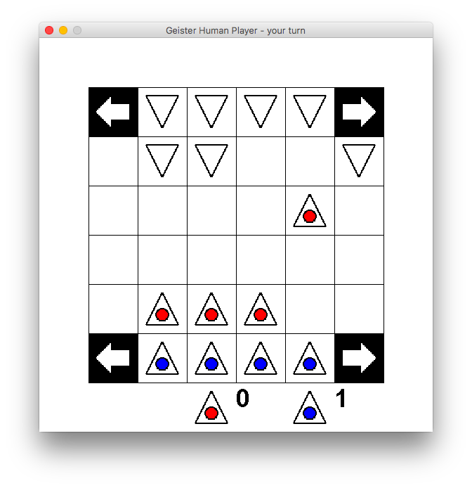
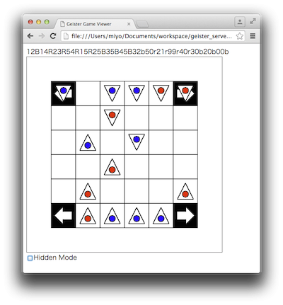

# geister_server (Java version)

Geister用のゲームサーバ．
ランダムに打つコンピュータプレーヤ，人間が遊ぶ時用のGUIがあります．
また，勝負の様子をWebSocket経由でブラウザで観賞することができます．
...のはずです．

## 動作概要
- 二つのクライアント(プレーヤ)とTCPで通信し，Geisterを進行する
- ボードの管理，勝敗の管理をする
- WebSocketで観戦用のグローバルな盤情報をキャストする

## 動作環境
- Java 8

## 盤面(仮)
        0 1 2 3 4 5
      0   h g f e
      1   d c b a
      2
      3
      4   A B C D
      5   E F G H
- サーバ側では表示のy=0の側を先手番の陣，y=5の側を後手番の陣とする
- プレーヤーは自分が先手なのか後手なのかによらず，y=5の側が自陣であるとする
- コマの名前は，ゲーム開始から終了まで変わらない
- コマが赤/青はゲーム開始前に，それぞれのクライアントに設定してもらう

## ゲームの進行
- サーバー: java net.wasamon.geister.TCPServerで2つのプレーヤインスタンス(それぞれ8個のコマを持つ)を生成してクライアントからの通信を待つ
 - 先手のクライアントは10000番，後手のクライアントは10001番で待ち受ける
- クライアント: クライアントは先手/後手に応じて10000番/10001番に接続．recvして"SET?"という文字列を受信する
- クライアント: クライアントは赤オバケを4つセットし，recvする
 - 赤オバケをセットするコマンドは，SET:ABCD\r\n
 - 正しく受理されると"OK \n\n"が，正しいコマンドでない場合は"NG \r\n"がサーバからクライアントに返される
- サーバー: 2つのクライアントが赤のコマをセットし終えると，サーバーは，先手番のクライアントに盤面情報を送ると共に手の入力を待ち受ける．
 - 盤面情報はコマの(x,y)と色(相手に非公開の赤/青=R/B，両者が見えている赤=r/青=b/不明=u)を ABCDEFGHabcdefgh (ここで小文字は相手のコマ)順に，並べたもの
 - たとえば初期状態は，14R24R34R44R15B25B35B45B41u31u21u11u40u30u20u10u
 - 取られたコマの座標は(9,9)
 - 盤外に逃げ出したコマンドの座標は(8,8)
 - 取った/取られたコマおよび盤外のコマ色は公開される．
 - 自分の手番によらずどちらのクラントも同じ方向からのビューを持つ(5の側が自陣，0の側が相手陣)
- クライアント: 先手番のクライアントは手を打ち，recvする．
 - 手を打つには， MOV:A,NORTH\r\n のように動かすコマ名と方角を送る
 - 方角はNORTH/EAST/WEST/SOUTHの4種類
  - それぞれ，N/E/W/Sの1文字で指定することも可
 - 正しく受理されると"OK \n\n"が，正しいコマンドでない場合は"NG \r\n"がサーバからクライアントに返される
- サーバー: サーバーは手を受理した先手番にACKを送信．後手番のクライアントに更新後の盤面情報を送る
 - ACKは正しく受理されると"OK \r\n"が，正しいコマンドでない場合は"NG \r\n"がサーバからクライアントに返される
 - その手で相手のコマをとった場合，その色が赤ならR，青ならBがACKに付与される
  - 赤を取ったなら"OKR\r\n"，青を取ったなら"OKB\r\n"
- クライアント: 後手番のクライアントは手を打ち，recvする．
- サーバー: 先手/後手のどちらかで勝負がついたら，両方に結果と終了時点での盤面情報を送る．
 - 勝った方にはWON，負けた方にはLSTを送る．
 
サーバがコマンドを受理するとOK/NGを返すようになったので，
対戦のプロトコルの詳細は，Pythonで書きかけていたバージョン https://github.com/miyo/geister_server と整合はとれていません(2017/01/08 現在)

## 実行例
### コンパイル
    gradle jar

### サーバー
    java -jar build/libs/geister.jar

でサーバーが起動します．

    java -jar build/libs/geister.jar --timeout=5 --budget=200

とすると，持ち時間200秒，タイムアウト5秒などと設定できます．
(デフォルトは持ち時間10分，タイムアウト10秒)

    java -jar build/libs/geister.jar --no_ng_terminate

と，--no_ng_terminateを着けて起動すると，不正な手を打った場合の負けを抑止することができます．
(デフォルトでは不正な手を打つと，即座に負けになります)

### テスト用クライアント
それぞれ別のターミナルなどで起動する．

    java -cp build/libs/geister.jar net.wasamon.geister.player.RandomPlayer localhost 10000 # 1st playerとして
    java -cp build/libs/geister.jar net.wasamon.geister.player.RandomPlayer localhost 10001 # 2nd playerとして

### テスト用クライアント(2)
HumanPlayerを使うと標準入力から手を入力できます．

    java -cp build/libs/geister.jar net.wasamon.geister.player.RandomPlayer localhost 10000 # 1st playerとして
    java -cp build/libs/geister.jar net.wasamon.geister.player.HumanPlayer localhost 10001 # 2nd playerとして

### テスト用クライアント(3)
HumanGUIPlayerを使うとGUIで遊ぶことができます．HumanGUIPlayer実行時の第3引数に，赤にセットするコマの名前を与えてください．A〜Hまでの4つから選択してください．

    java -cp build/libs/geister.jar net.wasamon.geister.player.RandomPlayer localhost 10000 # 1st playerとして
    java -cp build/libs/geister.jar net.wasamon.geister.player.HumanGUIPlayer localhost 10001 ABCD # 2nd playerとして

ドラッグアンドドロップでコマを動かして遊べます．

### 対戦の様子を観戦する
WebSocketで対戦中の盤情報が配信されます．

    resources/html/viewer.html

をWebSocket対応のWebブラウザで開いてください．

## プレーヤを作る場合は
TCPで通信すればよいので，何で作っても構いません．
もしJavaで書くのであればsrc/wasamon/geister/player/BasePlayer.javaを継承すると楽かもしれません．
その場合は，src/wasamon/geister/player/RandomPlayer.javaが参考になるかもしれません．

